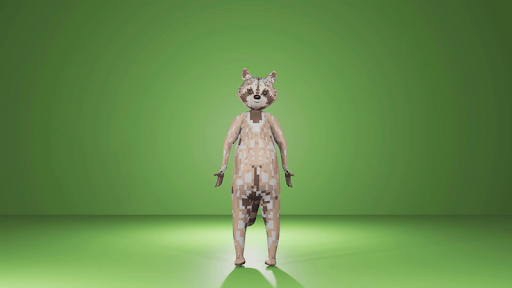

# LocoMotion

LocoMotion is the operating system and API for a speculative world remembered and imagined by a loose network of individuals. It is also a live coding language for choreography and movement, and can be used by itself (at https://dktr0.github.io/LocoMotion) or in the Estuary collaborative live coding platform (at https://estuary.mcmaster.ca). LocoMotion is free-and-open-source software, released under the terms of the GNU Public License, version 3. 

# Characters/Models/Avatars

There are basically no "humans" in this world. (No one knows why, honestly the question doesn't come up very often.)

Raccoons: Resourceful, curious, adaptable. Motion character: Usually appear in small groups (they are very social), with an interest in surrounding things, approaching things, formations (“tactical”). Expressive and communicative, for example, lots of hand motions, playful gestures, perhaps jumping, spinning, climbing. Perhaps a jazz or ballet dancer? 

</img>

SunStones [former StoneFigure]: large robots made of escarpment limestone or Virginian blue slate, plus recycled solar power materials. Unclear origin but possibly a result of self-directed evolution. Motion and animation character: very slow animations and motion, tendency towards stillness when in the light. Usually appears as a solitary character, un-generatively patterned (with the exception of a special scenario, the council of sunstones). 

Saplings: [NatureGirl to Camille,Willy,Branch, Leafy, Lily, Daffy]: Saplings:Childlike creatures of the forest (nymphs). Unknown origin. Motion character: often seeking spatial arrangements where they curiously touch/overlap just a little bit with each other, and possibly other things.

OrDroid [former CrackMan]: Former industrial worker robots. Motion character: Metric motion, nervous/anxious motion, higher speed animations, mechanical, repetitive, possibly work motions (grabbing, moving things, etc), possibly violent

DataGhost [former WireMan]: are not physically present but rather are seen by characters in our world as parts of a comprehensive virtual overlay of unknown origin and purpose, as wireframes (largely invariant to lighting). They can have different models and change/flicker between them, sometimes in glitchy ways. Everything from a default cube to a complete environmental model can be a dataghost. 
Produced as an effect of the language rather than the model (ie. any model in “dataghost” mode). Motion character: Kind of depends on the underlying model, but with a lot of potential for glitchy, not physically realistic motion.

Mushy: Mushrooms appear in huge clouds, unusual concept of personal space with lots of overlapping, can become environment/floor for Saplings; excessive in numbers

# Stories
Entrances: Introductions to individual characters. Code below to give examples.

OrDroid:
dancer { url = “OrDroid”, animation = [ 15,1,17,1,23,1,21,1], size = 3, y = -5, z - -5, x = range -5 5  (osc 0.5), dur = 2, ry = 90};

Saplings:
dancer { url = "Garden.glb", y = -2, size = 4}; 

dancer { url = "camille", size = 4, y = -5, animation = [20,1,21,1, 28,1], dur = -4 };
dancer { url = "Willy", size = 4, y = -5, x= 8, animation = 7, dur = 6 };
dancer { url = "Lily", size = 4, y = -6, x= -3, animation = 0, dur = 6 };

ambient { intensity = 4 };
camera { z = range -2 12 (osc 0.02)};


Council of SunStones


Dance Battles - The Cypher


Building :boxes


Quarry
clear { color = 0x5555A7};
ambient {intensity = 0.1};
point {color = 0x5555A7, x = 0, y = 3};

box {rx = 1, ry = 1, rz = 1, size = 16, y = -9};

for [0..9]  (\n -> box {x = -12, y = n*2, z = -10, rx = n*60, ry = n*30, rz = n*30, size=6});
for [0..9]  (\n -> box {x = -8, y = n*2, z = -10, rx = n*60, ry = n*30, rz = n*30, size=6});
for [0..9]  (\n -> box {x = -3, y = n*2, z = -10, rx = n*60, ry = n*30, rz = n*30, size=6});
for [0..9]  (\n -> box {x = -0, y = n*2, z = -10, rx = n*60, ry = n*30, rz = n*30, size=6});
for [0..9]  (\n -> box {x = 6, y = n*2, z = -10, rx = n*60, ry = n*30, rz = n*30, size=6});
for [0..9]  (\n -> box {x = 12, y = n*2, z = -10, rx = n*60, ry = n*30, rz = n*30, size=6});

dancer { url="Willy",animation = 3, dur = 12, size = 1, x= 0, y = -3, z = 1};
dancer { url="Willy",animation = 6, dur = 12, size = 1, x= 3, y = -3, z = 1};
dancer { url="Willy",animation = 12, dur = 12, size = 1, x= -3, y = -3, z = 1};
--camera { z = range 15 -15 (osc 0.01)};


Mushroom Floor
clear {color = 0x6988B5};
ambient {intensity = 1};
point {color = 0x5555A7, x = 0, y = 3};
directional { colour=0xf00f80, intensity = 2, z = 4, y = 10, x = -6 };

--mushroom floor
for [0..4]  (\n -> dancer {url = "Camille", dur = n*0.5, x = (n)+(-20), y = -8, z = -10, rx = 0, ry = 0, rz = 0, size=2});
for [0..100]  (\n -> dancer {url = "mushy.glb", dur = n*0.5, x = (n)+(-20), y = -6, z = -10, rx = 0, ry = 0, rz = 0, size=2});
for [0..100]  (\n -> dancer {url = "mushy.glb", dur = n*0.5, x = (n)+(-20), y = -4, z = -10, rx = 0, ry = 0, rz = 0, size=2});

dancer { url="Willy",animation = 3, dur = 12, size = 3.5, x= 0, y = -8, z = -3};
dancer { url="Willy",animation = 6, dur = 12, size = 3.5, x= 3, y = -8, z = -5};
dancer { url="Willy",animation = 12, dur = 12, size = 3.5, x= -3, y = -8, z = 1};


Warehouse Algorave
-- bar background
for [-3..84]  (\n -> box {x = (n/2)-(20), y = (osc((0.5) + ((n/2)/(100)))*sin(n/2)) + (-7), z = -20, sy = 20, size=1.5, color = 0x2AFF00});

for [-3..84]  (\n -> box {x = (n/2)-(20), y = (osc((0.5) + ((n/2)/(100)))*sin(n/2)) + (-8), z = -10, sy = 20, size=1.5, color = 0xA6FF95});

--front droid
dancer { url="OrDroid", size = 5, animation = 66, x = 9, y = -14, z = 0, dur = 0.8, ry = -0.5};

box {rx = 0, ry = 0, rz = 0, size = 20, y = -11};

point {color = 0xFFFEE0, intensity = 0.4, x = -6, z = -6};
point {color = 0xFFFEE0, intensity = 0.4, x = -5, z = 0};
point {color = 0xFFFEE0, intensity = 0.4, x = -4, z = 4};

point {color = 0xFFFEE0, intensity = 0.4, x = 6, z = -6};
point {color = 0xFFFEE0, intensity = 0.4, x = 5, z = 0};
point {color = 0xFFFEE0, intensity = 0.4, x = 4, z = 4};

-- glitch droid
dancer { url="OrDroid", size = 2.5, animation = 15, x = -3, y = -8, z = -5, dur = 0.5, ry = -0.5};
dancer { url="OrDroid", size = 2.5, animation = 17, x = -2.9, y = -8, z = -4, dur = 0.5};

-- assembling droid
dancer { url="OrDroid", size = 2.5, animation = 2, x = 10, y = -8, z = -13, ry = 35, dur = 0.5};
-- mid right boxes
box {size = 1, z = -20, x = 12, y = -5};
box {size = 1, z = -20, x = 13, y = -4};
box {size = 1, z = -20, x = 13.5, y = -5};
box {size = 1, z = -16, x = 13.5, y = -4, ry = 15};
box {size = 1, z = -16, x = 13, y = -5, ry = 15};
box {size = 1, z = -16, x = 15, y = -4.5, ry = 15};
box {size = 1, z = -16, x = 12, y = -4.5, ry = 15};
box {size = 1, z = -16, x = 14, y = -5.25, ry = 15};

-- walking droid
dancer { url="crackman.glb", size = 2.75, animation = 47, dur = 1, x = -16, y = -8, ry = 3.14, z = -15};

--back left boxes
box {size = 1.5, z = -30, x = -12, y = -5, ry = -20};


LocoMotion is being developed as part of a research project lead by David Ogborn and Kate Sicchio, funded by the New Frontiers in Research Fund (Exploration stream) of Canada. Research assistants contributing to the project, at both McMaster University and Virginia Commonwealth University, are: Shaden Ahmed, Ashmeet Dhaliwal, Fatima Ghaderi, Milica Hinic, Misha Joao, Esther Kim, Raahil Mahetaji, Saiara Mashiat, Karthyayani Ramesh, and Vic Wojciechowska.

We hesitate to document the language much at this point, as the notations are very much in flux - it is entirely possible that something that works in the language now would be removed at a moment's notice as we experiment with different possibilities. That said, enthusiastic onlookers may be able to intuit some of the possibilities from the demo program in the standalone at https://dktr0.github.io/LocoMotion or from videos that appear in this youtube playlist: https://www.youtube.com/watch?v=L1r62fG6fHM&list=PLz3wq0ad0gSYc0NhFG2ucAdnttFy5a99K


<br></br>

> ### **Getting Started**
> As mentioned above, the LocoMotion demo is accessible through both the Estuary platform and the demo program in the standalone at https://dktr0.github.io/LocoMotion. You should be able to see the description provided below on the website:
> ```
>-- Welcome to LocoMotion
>-- A live coding language for dance, choreography, motion, etc
>-- Type programs here and click the "Eval" button to make them go
>-- This is a rapidly emerging work in progress - check back often for updates
>-- Or get in touch on the Estuary discord server!
>-- More info here: https://github.com/dktr0/LocoMotion#readme
>-- And then you can make changes and press shift-Enter to re-evaluate!
>```
> As described, You will need to pick a model as your dancer, and then you can change the size or relocate it in the provided environment. 
>Also, you can adjust the floor color or the provided globe environment (We are still working on it).
>
>The camera could also be relocated in the provided environment. Following, you can find further information about how and what you could evaluate in LocoMotion.
 <br><br> 
 

<br> <br> <br>


# Dancers

For a valid LocoMotion program, it is needed to evaluate the model you wish to appear in this form:

```
dancer { url="NAME OF THE MODEL.glb", size = ANUMBER , x = ANUMBER , y = ANUMBER , z = ANUMBER   };

```
Remember that the numbers entered should be Rational numbers (Q). For example, if you want to log "Lisa" as your dancer, the following could be the required code for evaluating in the LocoMotion:

 
```
dancer { url="lisa.glb", size = 0.0 , x = -3 };

```
You can create multiple dancers by separating each line by a semicolon `;`

```
dancer { x = 1, y = 2, z = 3 };
dancer { x = (-1), y = 2, z = 0 }
```


<br> <br>
# Models

You can change the dancer model by inputing a new `url`. Find the current models available at the following link: https://github.com/dktr0/LocoMotion/tree/main/models.

<br>
Below is the full list of available models for evaluating: 

- Alan
- Bboy
- Daffy
- Diver
- Lily
- Lisa
- NatureGirl
- Oak
- StoneFigure
- Woman
- ant
- benny
- cactus
- forest
- racoon
- woodman
- wireman

<br>

PS: Capitalazation is importat here!


There are also other features which you can adjust while live coding you dancers such as:
## 1. Size
If you don't want to log any of these provided dancers, you can skip picking dancer and type the following for the default one:

```
dancer { size = ANUMBER}
```

## 2. Position 
 (Shown in ``x``,``y`` and ``z``) of the dancer on the floor . 

## 3. Duration:
The duration parameter (``dur``) of movement for each dancer. For example `` dur = 2`` is going to faster the pace twice as it was.

## 4. Oscillation:
 It's possible to use oscillators (``osc``) output values which is by default between -1 and 1. For example you can input `` x = osc 1`` and the result would be movement of your charecter in the x axis. It will result the changes from range 1 to -1 in the x axis. if you do it ``x = osc 2`` it will be twice as fast again in 1 and -1.
``x = osc 0.5 `` 
``x = osc 0.5 * 3+3 `` that is one way of changing the motion of your charatecters.
You can also push it further by something like `` x= range 0 2 (osc 0.5)`` it will move in the range of 0 and 2.
``x= range 0 2 1 (osc 0.5)`` with that 1 the character will be locked there.
Also Notice that putting () could help with distinguishing the number. For example we could distinguiosh the -1 and (-1).

## 5. Animation
Each dancer model has multiple animations associated with it. To change the animation, change the number for the `animation` parameter:

```
 dancer { url = "Oak.glb", animation = 2, z = 5, x = 2 } 
 ```
 For example for models there are currently different dance movements from 1 to 37. It might be a little bit confusing if you put 38, 39 etc, It will automatically wrap it up and start from 0. 
## 6. Range
By default and oscillator outputs values between -1 and 1, to change the range of motion you can use the `range` function

```
 dancer { url = "lisa.glb", dur = 3, x = range (-2) 2 (osc 0.25), y = (-1) } 
 ```


## 7. Rotation
 there are two ways of rotationg models in the lococmotion. Rotation is always in degrees so the range would be 0 to 360 degrees which 360 would result the carachter facing us again.
 <br>
`rx`: Rotation around X axis
<br>
`ry`: Rotation around Y axis
<br>
`rz`: Rotation around Z axis

For Example:

```
 dancer { url = "lisa.glb", ry = 90 }
  ```

Alternatively, you can direct dancers to "look at" a particular location by using these parameters and giving them coordinates:
<br>
 `lx` : Look at X axis
 <br>
  `ly` : Look at X axis
  <br>
  `lz` : Look at Z axis

For Example:

``` 
dancer { url = "lisa.glb", lx = 0, ly = 0, lz = 0 }
 ```


<br>

For example a complete code for evaluating a dancer in LocoMotion would be like this:

```
dancer {url = "lisa.glb", x=1, size 0.6}
```

<br>

> ## Note:
> You can add as many dancers that you want in the dance floor. 
> <br> <br>

<br> <br>

# Plane
To place your models on the scene, You will need a dance floor which could be evaluated simply by typing down ``` plane ``` and evaluating it.


again `rx` , `ry` and `rz` for the rotation.
`lx` , `ly` and `lz` for the looking at.
`sx` , `sy` and `sz` are for changing the size of the object in each axis. so for the plane we will change it untill it would be visible.

It is possible to customize the color of the hexadecimal color code. 

> ### **Note:**
> When making a RGB hexadecimal color code, the numbers are preceeded by a pound sign (#). The 6-digit hexadecimal number is divided into 3 parts:
> - The first two numbers are for red.
> - The second two numbers are for green.
> - The last two numbers are for blue.
>
> Note that hexadecimal 00 has no color, and hexadecimal FF is 100% of that color. For example:
> - #FF0000 is red, which has no green or blue.
> - #00FF00 is green, which has no blue or red.
> - #0000FF is blue, which has no red or green.
> <br> <br>

For example for having floor in green, You should evaluate this code:

```
plane {color = 0x00888};
```
You can find hexadecimal color codes to use on the web at sites like this: https://www.w3schools.com/colors/colors_picker.asp Make sure you prepend each 6 digit color code with `0x` otherwise LocoMotion won't understand

<br> 
</br>

# Camera

There is the possibilty of repositioning the camera in the scene by typing down the ``` camera ``` and given x, y and z dimensions to it. To reposition it and make it look at things.

so for looing at differrnt things it ould be like `lx` , `ly` , `lz`. 

 If you are using LocoMotion in Estuary https://estuary.mcmaster.ca You must place the camera code in the lower right hand corner box in order to it to function. There can be only one camera panel

```
 camera { x:(-4),y:2,z:10} 
 ```


<br>
</br>

# Light
Working with the LocoMotion, There is a default ambient light. 
But overall there are currently 6 types of lights available in LocoMotion, 3 types are `ambient` `point` and `directional`. Each light can accept an `intensity` parameter to indicate how bright the light is. Point and Directional light can be given a position. A point light emits in all directions whereas directional emits in a specific direction.
For making it darker or brighter you a=can use the code :
``` 
ambient { intensity = rage 0.3 1.0 ( osc 0.5 )}
``` 
This can cause to lighter or dimmer the light accprsing to the background music being played.

there is a point light as well. which is more likly to a light bulb
```
 point { x= range 0 2  y= 1 , z = 0 , colour = zz} 
 ```

directional light
 ``` 
 directional { x= 10 , ly}
 ```

All 6 types of lights are based on underline lights available on ThreeJS which is the basic library for some of our underline features.


